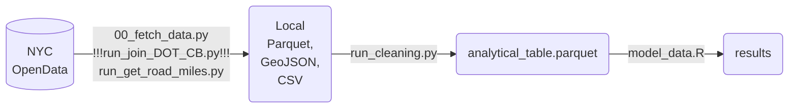

## NYC Potholes

--- ***WORK IN PROGRESS*** ---

#### A question in an interview ...
This project was borne of a case-study exercise asked to me during a 2026 job interview for a role in the NYC Office of Technology & Innovation. It began with the question: "How could we assess whether 311 calls are representative of the everyday problems that face New Yorkers?". The findings 

#### 
In an effort to brush up my Python, SQL, and production code-writing, I attempted to actually do that project using NYC's plethora of open data. It grew into an effort to quantify a **reporting gap index**, capturing the difference between what New Yorkers report and what the city actually addresses. The hypothesis was that the **index** would differ along some demographic lines and indicate where city and citizen were dissonant. TL;DR: No community districts showed a gap that reached statistical significance. The city and citizens were in harmony, at least when it comes to potholes in 2023-2024.

""So, to my gracious interviewer: you can take this to the mayor. Citizen calls to 311 do a remarkably fine job representing the issues faced by New Yorkers. ""

The project integrates and models the discrepancy between citizen reporting and city action using 5 datasets: 1) 311 pothole calls; 2) DOT pothole repairs; 3) NYC community district boundaries; 4) ACS demographics; and 5) Street centerlines



Figures for the writeup can be reproduced using `FigureNotebook.ipynb`.

### Data - 311 calls and Department of Transportation repairs:
Copy `.env.example` to `.env` and fill in your token (get one free at https://data.cityofnewyork.us/profile/edit/developer_settings).

Pulled 75,058 rows on 2026-06-09T18:45:19.877383
Saved to data/raw/311_pothole
Pulled 33,332 rows on 2026-06-09T18:45:28.246804
Saved to data/raw/dot_pothole_repairs

### Data - Community Districts:
Community districts map pulled on 6/9/2026 from NYC OpenData as GeoJSON (version 26b, May 26, 2026)
https://data.cityofnewyork.us/City-Government/Community-Districts/5crt-au7u/

### Data - American Community Survey (ACS):
5-year ACS 2019-2023 Community District-PUMA estimates downloaded from NYC Department of City Planning on 6/11/2026.
URL: https://www.nyc.gov/content/planning/pages/resources/datasets/american-community-survey
Estimate columns manually extracted from Demographic, Economic, Housing, Social workbooks into `acs_covariates.csv`. 
Variables retained:
- Pop_1E (Dem_1923_CDTA.xlsx) as `total_population`
- MdAgeE (Dem_1923_CDTA.xlsx) as `median_age`
- MdHHIncE (Econ_1923_CDTA.xlsx) as `median_household_income`
- ROcHU1P (Hous_1923_CDTA.xlsx) as `pct_renters`
- RntVacRtE (Hous_1923_CDTA.xlsx) as `rental_vacancy_rate`
- EA_BchDHP (Soc_1923_CDTA.xlsx) as `pct_with_college_degree`
- Fb1P (Soc_1923_CDTA.xlsx) as `pct_foreign_born`

Variance columns (margin-of-error, coefficient of variation) excluded for this version. Community District rows match across workbooks. Can just copy+paste the relevant columns into a new worksheet to save as `.csv`. Don't rename the columns. `04_attach_acs.sql` takes care of the formatting. 

### Data - Street Centerlines:
Obtained on 6/12/2026
URL: https://data.cityofnewyork.us/City-Government/Centerline/inkn-q76z
Spatial overlay with GeoPandas to get total `road_miles` per community district
```{python}
streets_total = streets.geometry.length.sum() / 5280
intersect_total = intersect.geometry.length.sum() / 5280
print(f"Streets total miles: {streets_total:.0f}")
print(f"Intersect total miles: {intersect_total:.0f}")
print(f"Lost to overlay: {(streets_total - intersect_total) / streets_total * 100:.1f}%")
```
Streets total miles: 7214
Intersect total miles: 7177
Lost to overlay: 0.5%
(this includes JIA districts)